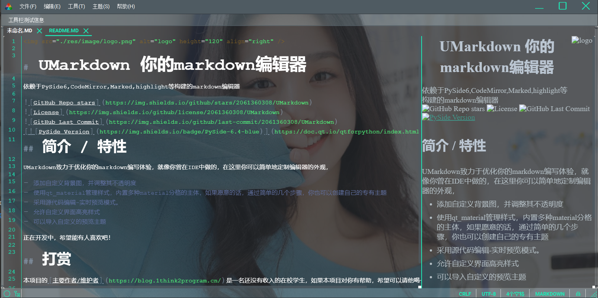

# UMarkdown 你的markdown编辑器

依赖于PySide6,CodeMirror,Marked,highlight等构建的markdown编辑器

## 界面截图
> 暗色系

> 亮色系

> 极简系

> 其他多种主题

## 简介 / 特性

UMarkdown致力于优化你的markdown编写体验，就像你曾在IDE中做的，在这里你可以简单地定制编辑器的外观，

- 添加自定义背景图，并调整其不透明度
- 使用qt_material管理样式，内置多种material分格的主体，如果愿意的话，通过简单的几个步骤，你也可以创建自己的专有主题
- 采用源代码编辑-实时预览模式。
- 允许自定义界面高亮样式
- 可以导入自定义的预览主题

正在开发中，希望能有人喜欢吧！

## 打赏

本项目的[主要作者/维护者](https://blog.1think2program.cn/)是一名还没有收入的在校学生，如果本项目对你有帮助，希望可以请他喝一杯奶茶 :beer:。

